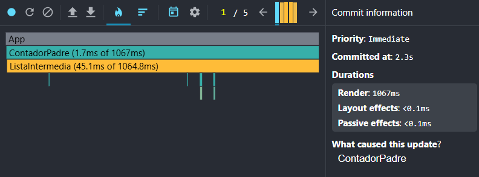
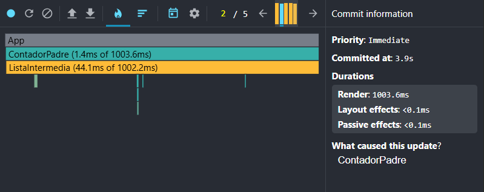
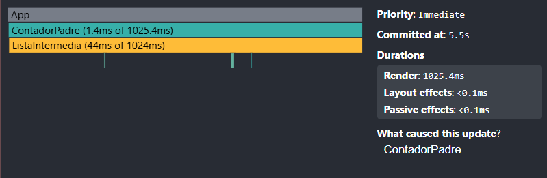
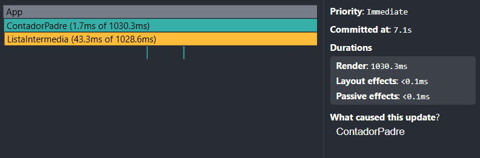
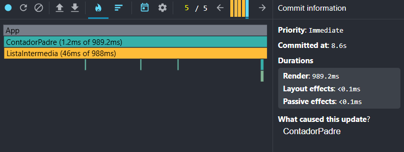

Antes de la optimizacion: 

En el primer incremento:

En el segundo incremento: 

En el tercer incremento: 

En el cuarto incremento:

En el quinto incremento:

4. ¿Se ve lento el navegador?¿Cuantas funciones (console.log) se ejecutan en cada click?
El navegador va lento, ya que cada click se estan cargando aproximadamente 2000 console.log.

5. ¿Son todos los renderizados necesarios?¿Por qué?
No, no son necesarios ya que React vuelve a ejecutar todo el árbol de componentes hijo cadavez que cambia el estado de un componente
padre (ContadorPadre) y aunque el contador sea lo unico que se ejecuta, todos los hijos se vuelven a renderizar.

Despues de la optimizacion con useMemo();