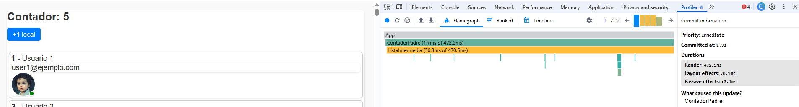
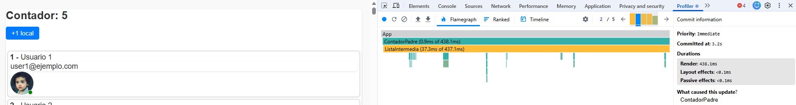
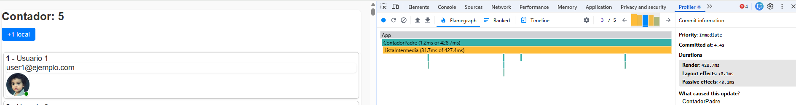
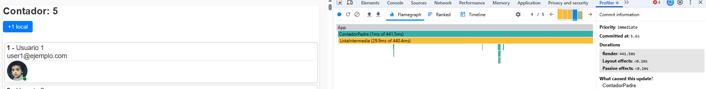
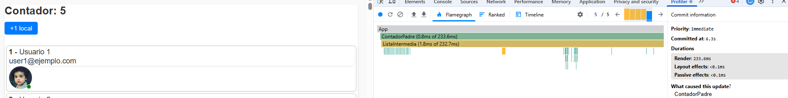
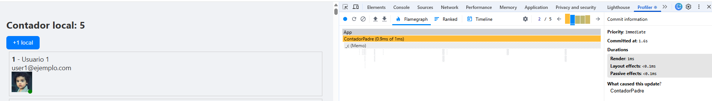
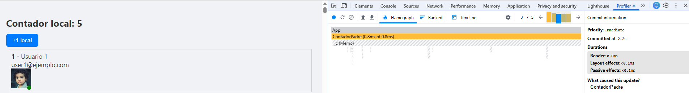
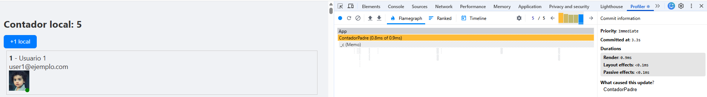

-- Pregunta 3 --

VERSION SIN OPTIMIZAR:

    Primer click:
     

     

    
    Segundo click:
         
        
    
    Tercer click:

        
    
    Cuarto click:

        
    
    Quito click:

        

-- Pregunta 4 -- 

   Mi navegador se ve lento ya que en cada modificacion se renderizan todos los elementos.
   
    En cada click del contador,se ejecutan el console.log de todos los elementos el siguiente número de veces:

            - ContadorPadre--> 1
            - ListaIntermedia--> 1
            - TarjetaUsuario--> 500
            - Avatar--> 500
            - IconoOnline--> 500
            - PuntitoVerde-->500

-- Pregunta 5 --
   
   No, no sería necesario renderizar todos los componetes, ya que el contador no afecta a los usuarios, pero como  
   como el codigo no esta optimizado, React vuelve renderizar todo.
        

VERSION OPTIMIZADA:

   Primer click:
     
       
    
    Segundo click:
         
        
    
    Tercer click:

        
    
    Cuarto click:

        
    
    Quinto click:

        
   

-- Pregunta 4 -- 

   Mi navegador no se ve lento ya que después de realizar la optimización con el useMemo, unicamente se renderizan los 
   elementos que estamos modificanddo.

   En cada click del contador, solo se ejecuta un solo console.log que es el del contenedorPadre.

-- Pregunta 5 --
   
   No, no son necesarios, porque cada vez que cambia el estado del componente padre (ContadorPadre), React vuelve a renderizar todo el árbol de componentes hijo. Aunque el contador sea lo único que cambia, todos los componentes hijos se renderizan igualmente.
