-- Pregunta 3 --

VERSION SIN OPTIMIZAR:

    BUSQUEDA POR NOMBRE:

        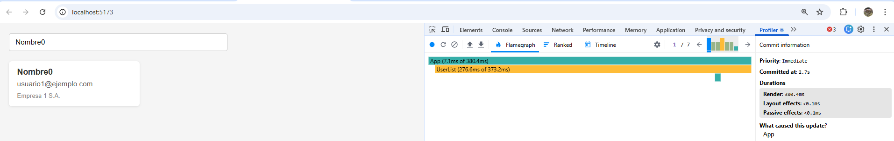

        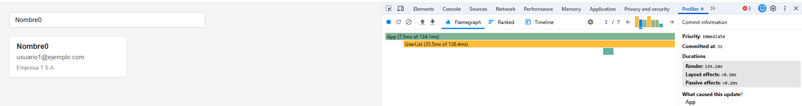

        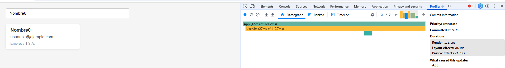

        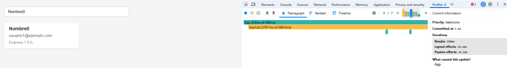

        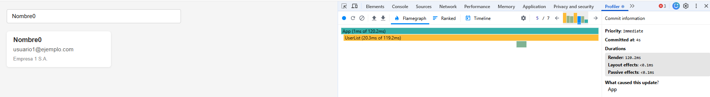

        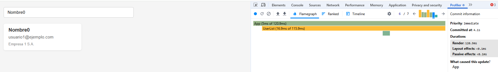

        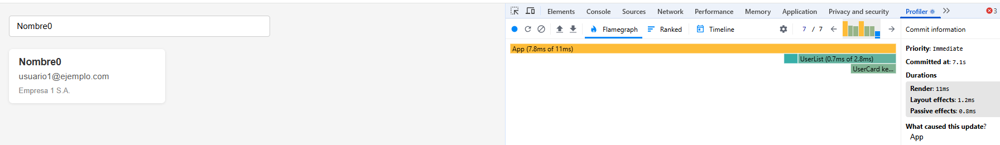

    BUSQUEDA POR CORREO:

        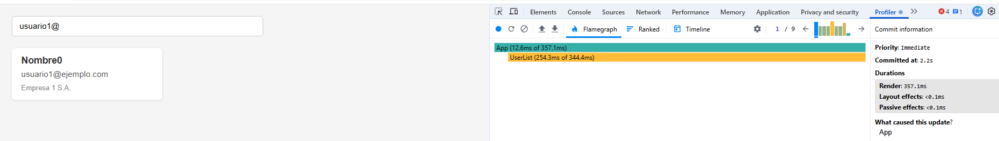

        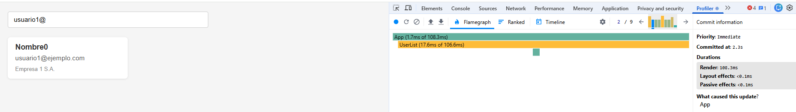

        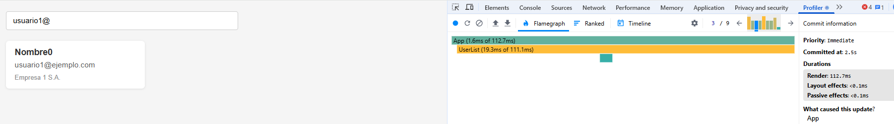

        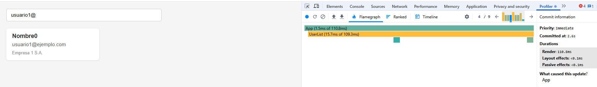

        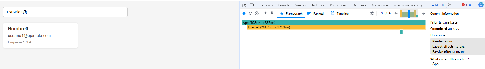

        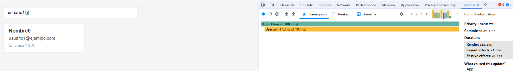

        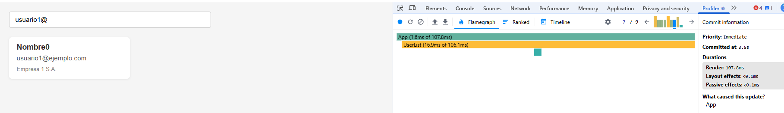

        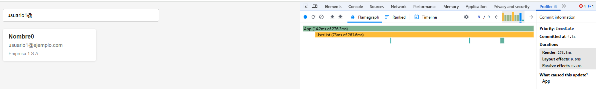

        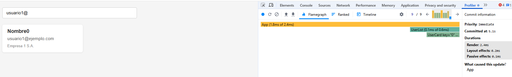

--  La aplicación va muy lenta ¿Cuáles son sus puntos débiles? -- 

        - Cada vez que escribo en el buscador se vuelve a renderizar toda la lista de usuarios.

        - Las tarjetas de usuario se renderizan aunque no cambien sus datos

        - El filtro se ejecuta en cada renderizado

VERSION OPTIMIZADA:

    BUSQUEDA POR NOMBRE:

        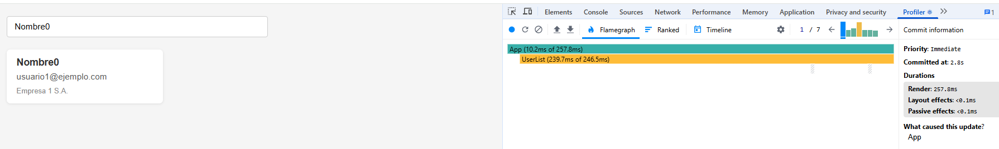

        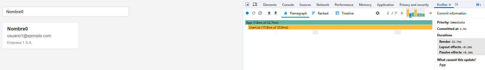

        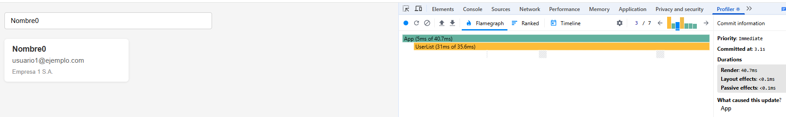

        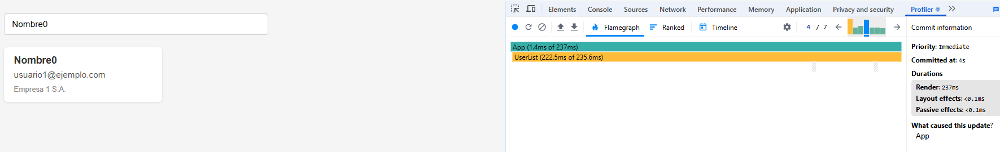

        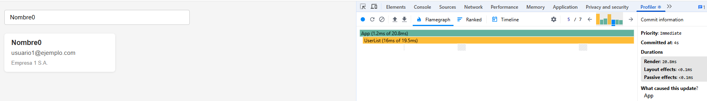

        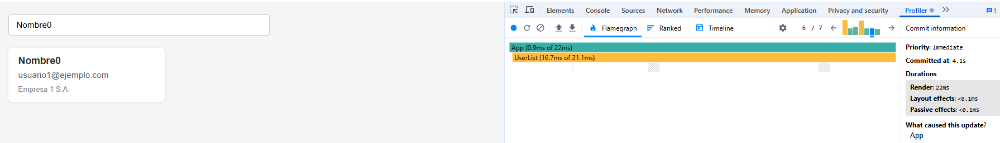

        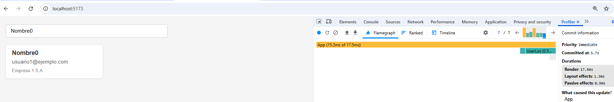

    BUSQUEDA POR CORREO:

        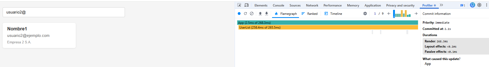

        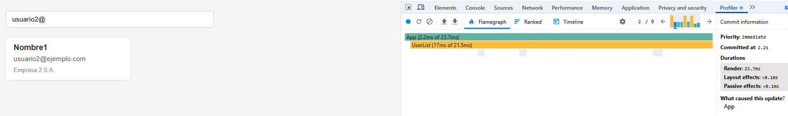

        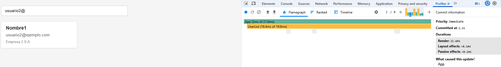

        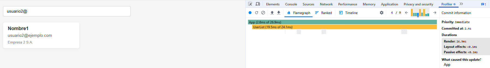

        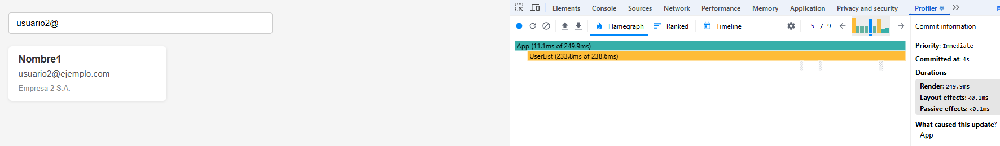

        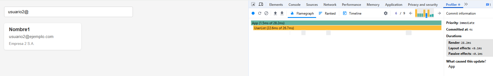

        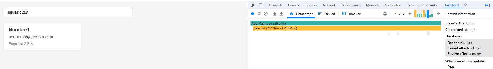

        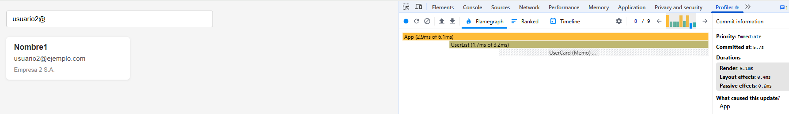

        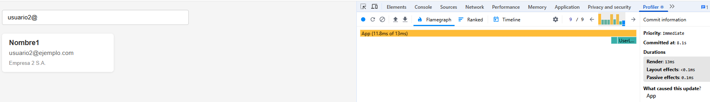

--  ¿A mejorado la velocidad de la aplicación? -- 

        Sí, la velocidad de la aplicación ha mejorado muchísimo, ya que al usar useMemo se evita recalcular la lista de usuarios cada vez que el input cambia y además, no se renderizan las tarjetas que no han cambiado.

--  ¿qué cambios y por qué has hecho?  -- 

        - En App, añadi useMemo en el filter para que memorice el resultado de usuarios.filter y solo se recalcule cuando el search cambia.

            const usuariosFiltrados = useMemo(() => {
                 return usuarios.filter(usuario =>
                    usuario.nombre.toLowerCase().includes(search.toLowerCase()) ||
                    usuario.email.toLowerCase().includes(search.toLowerCase())
                );
            }, [search]);

        - En UserCard, volví a utilizar el useMemo para que si los props que se le pasan no cambian React no vuelva a renderizar todas las tarjetas cada vez que el usuario escribe en el input       

            const UserCard = memo(function UserCard({ usuario }) {

                //Contenido Metodo

            });