-- Rendimiento Profiler Antes de utilizar el useCallback y el React.memo()--

    - Añado el primer error:

           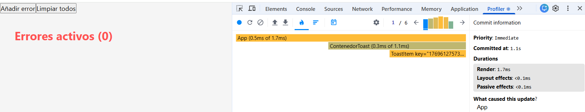

    - Añado el segundo error:
    
           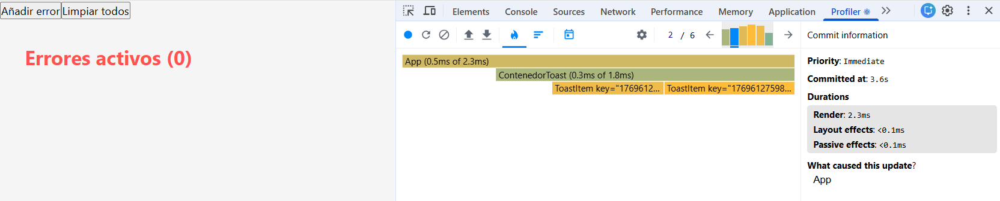 

            
    - Añado el tercer error:
    
            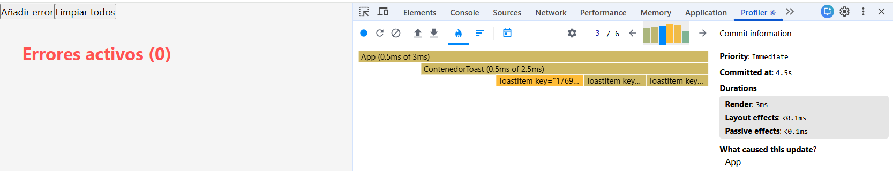

     - Añado el cuarto error:
    
            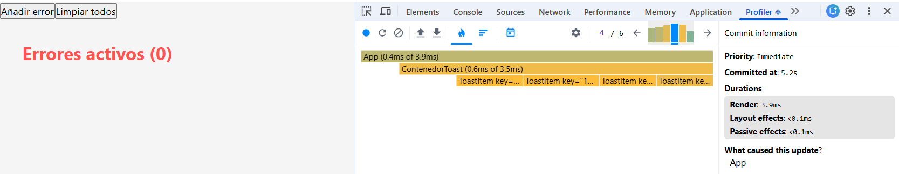 

     - Elimino el primer error:
    
            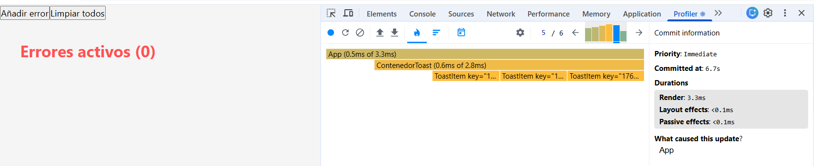

     - Elimino todos errores:
    
            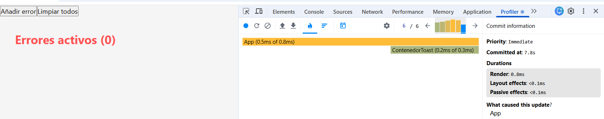

-- Codigo Antes de las modificaciones -- 

    - App.jsx:

            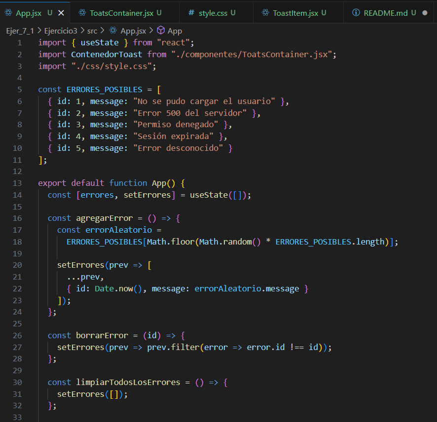

            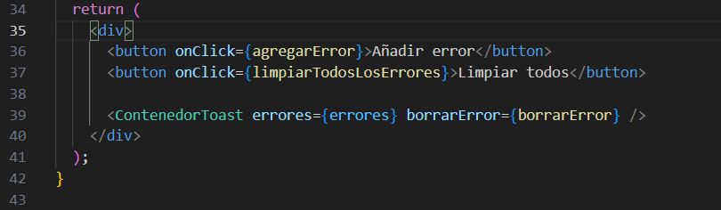

    - ToastContainer.jsx:

            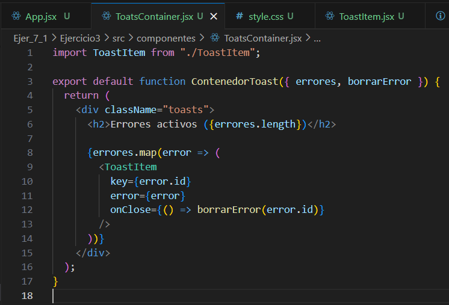

    
    - ToastItem.jsx

            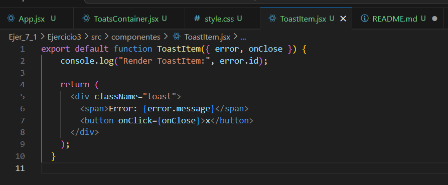

-- Codigo Después de las modificaciones -- 

    - App.jsx

        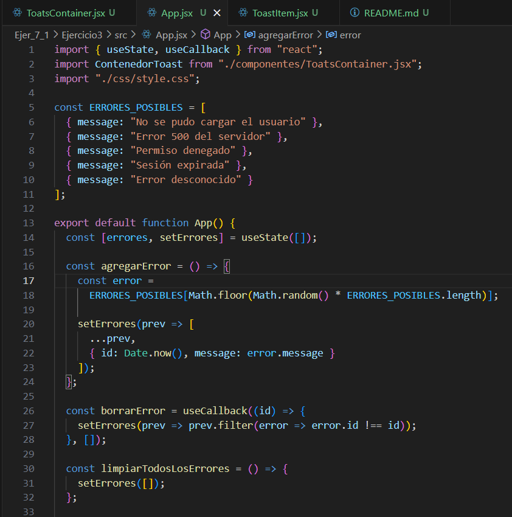

        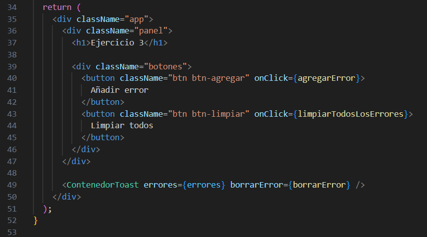

    
    - ToastContainer.jsx:

            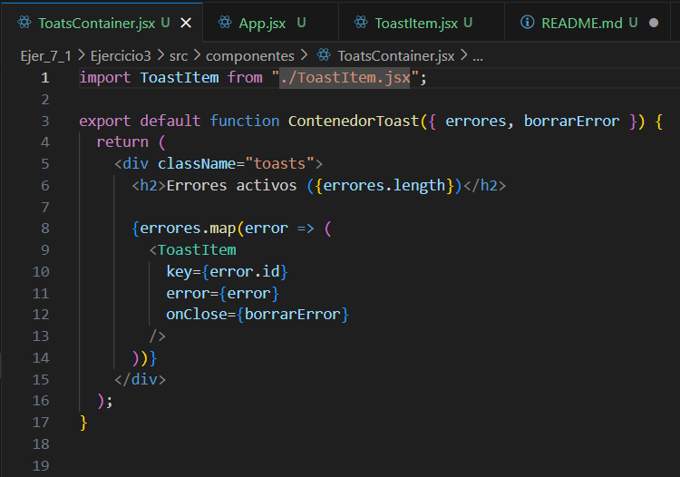

    
    - ToastItem.jsx

            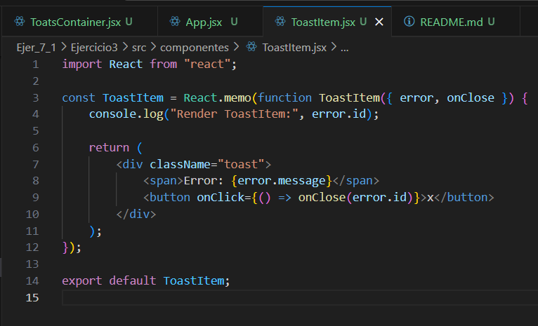

-- Rendimiento Profiler Después de utilizar el useCallback y el React.memo()--

    - Añado el primer error:

           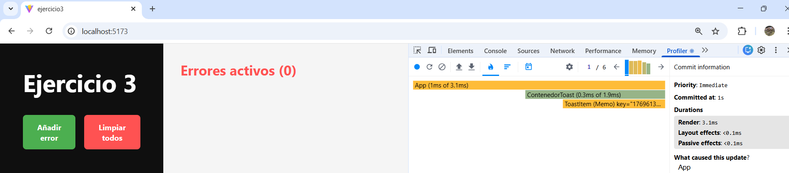

    - Añado el segundo error:
    
           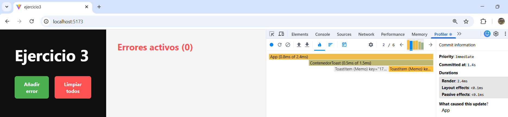

            
    - Añado el tercer error:
    
            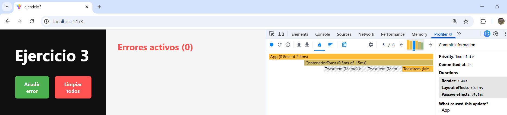

     - Añado el cuarto error:
    
            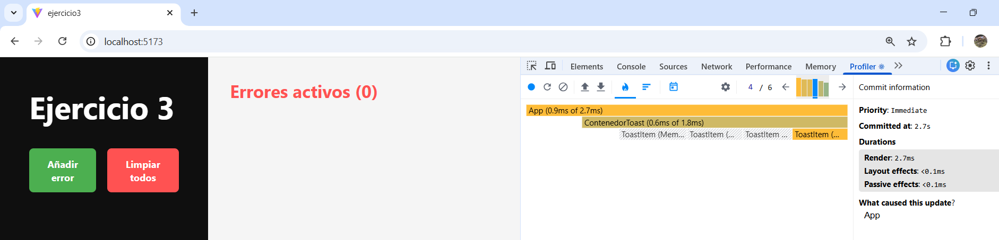

     - Elimino el primer error:
    
            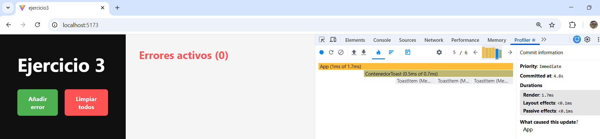

     - Elimino todos errores:
    
            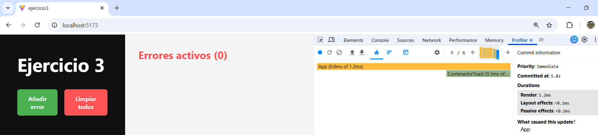

Realice estas modificaciones porque antes cada vez que agregaba o eliminaba un error, todos los componentes del ToastItem se volvian a renderizar, debido a que le pasaba funciones inlines como props y React las consideraba como nuevas en cada render.

Para mejorar el rendimiento, lo que hice fue utilizar useCallback en la funcion borrarError y React.memo en el ToastItem, para evitar asi renders innecesarios y que solo se renderice el Toast que esta cambiando.

Funcion borrarError, aqui utilizo el useCallback:

        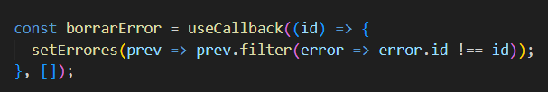

ToastItem donde utilizo el React.memo
        
        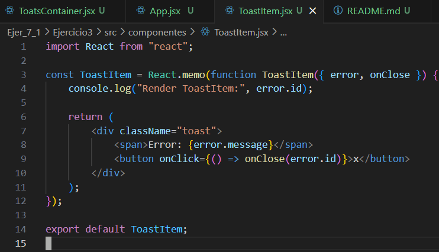